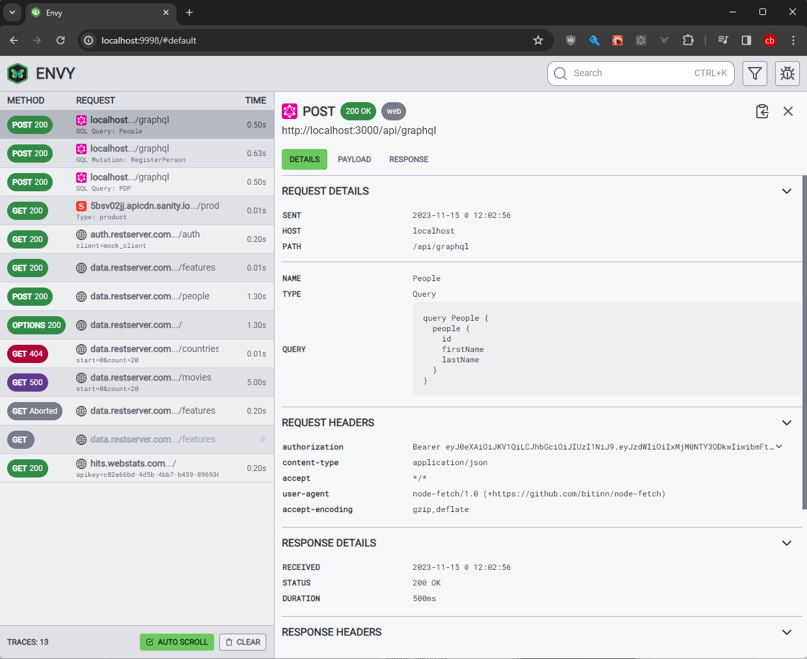

<div align="center">
  <a href="https://formidable.com/open-source/" target="_blank">
    
  </a>

  <strong>
    Zero Config Node.js Telemetry &amp; Network Viewer
  </strong>

  <br />
  <br />

  <a href="https://github.com/FormidableLabs/envy/actions">
    
  </a>
  <a href="https://github.com/FormidableLabs/envy#maintenance-status">
    
  </a>

  <br />
  <br />
</div>

# Envy

Envy will trace the network calls from every application in your stack and allow you to view them in a central place. Whether you are running a Node.js backend, Express, Apollo, or even a Next.js server, Envy will capture it all.

_Note: Envy is intended for development usage only, and is not a replacement for optimized production telemetry_

<div align="center">
  
</div>

## Contents

- [Getting Started](#getting-started)
- [Additional Options](#additional-options)
- [Customizing](#customizing)
- [Production Bundles](#production-bundles)
- [Contributing](#contributing)

## Getting Started

### 1. Install the Envy Web UI to view application telemetry in your browser

```sh
# npm
$ npm i --save-dev @envyjs/webui
# or yarn
$ yarn add --dev @envyjs/webui
```

### 2. Install a telemetry package for your application

- [Node.js Application](#nodejs-application)
- [Web Client Application](#web-client-application)
- [Next.js Application](#nextjs-application)

### 3. Run the Web UI and start collecting telemetry

Run the browser in a seperate terminal session

```
npx @envyjs/webui
```

or optionally, add it to your NPM scripts using a tool like [concurrently](https://www.npmjs.com/package/concurrently)

```json
"scripts": {
  "start": "<your application start command>",
  "start:withenvy": "concurrently \"npx @envyjs/webui\" \"npm start\""
},
```

## Available Telemetry Packages

### Node.js Application

Install the `@envyjs/node` sender package in your node application:

```sh
# npm
$ npm i --save-dev @envyjs/node
# or yarn
$ yarn add --dev @envyjs/node
```

Import and invoke the `enableTracing` function to the root of your app before any other code.

```ts
import { enableTracing } from '@envyjs/node';
enableTracing({ serviceName: 'your-node-app-name' });

// ... your app code
```

### Web Client Application

Install the `@envyjs/web` sender package in your website:

```sh
# npm
$ npm i --save-dev @envyjs/web
# or yarn
$ yarn add --dev @envyjs/web
```

Import the `enableTracing` function to the root of your app, and invoke it before mounting your application.

For example, in a simple React application:

```ts
import { enableTracing } from '@envyjs/web';
import { createRoot } from 'react-dom/client';

import { App } from './App';

const container = document.getElementById('app');
const root = createRoot(container);

enableTracing({ serviceName: 'your-website-name' }).then(() => {
  root.render(<App />);
});
```

### Next.js Application

Install the `@envyjs/nextjs` sender package in your node application:

```sh
# npm
$ npm i --save-dev @envyjs/nextjs
# or yarn
$ yarn add --dev @envyjs/nextjs
```

Import and wrap your Next config `next.config.js` file with Envy

```ts
// next.config.js
const { withEnvy } = require('@envyjs/nextjs');

/** @type {import('next').NextConfig} */
const nextConfig = {};

const envyConfig = {
  serviceName: 'next-app',
};

module.exports = withEnvy(nextConfig, envyConfig);
```

*By default, `@envyjs/nextjs` will only inject itself into your `development` bundle.*

#### Timing Data

_Browsers prevent full timing data from being accessed from cross-origin requests unless the server responds with the [Timing-Allow-Origin](https://developer.mozilla.org/en-US/docs/Web/HTTP/Headers/Timing-Allow-Origin) header_.

## Additional Options

Envy supports these additional options for senders

#### Filtering

You can filter the requests that are traced by setting a `filter` function that returns `true` for all traces you want to keep. (The same way javascript array.filter works)

```ts
enableTracing({ 
  serviceName: 'example-nextjs',

  // ignores requests to google.com
  filter: request => request.host !== 'google.com'
});
```

#### Debug

You can see the information we send to the Web UI by setting the Debug option

```ts
enableTracing({ 
  serviceName: 'example-nextjs',
  debug: true
});
```

## Customizing

Whilst Envy will run as a zero-config standalone viewer, it is also possible to run the Envy viewer locally from your application and to define your own systems to customize how traces are presented.

See the [customization docs](docs/customizing.md) for more information.

## Production Bundles

Envy is designed to enhance your developer experience and is not intended for production usage. Depending on your application, there are various ways to exclude it from your bundle in production.

### Dynamic Imports (Typescript)

```ts
if (process.env.NODE_ENV !== 'production') {
  import('@envyjs/node').then(({ enableTracing }) => {
    enableTracing({ serviceName: 'examples/apollo' });
  });
}
```

### Dynamic Require (Javascript)

```js
if (process.env.NODE_ENV !== 'production') {
  const { enableTracing } = require('@envyjs/node');
  enableTracing({ serviceName: 'examples/apollo' });
}
```

### Disabling Tracing

This option is the simplest, but will leave the code in your output bundle. Depending on your application and its deployment and packaging method, this may be acceptable in your usage.

```ts
import { enableTracing } from '@envyjs/node';
if (process.env.NODE_ENV !== 'production') {
  enableTracing({ serviceName: 'examples/apollo' });
}
```

## Contributing

Please see the [Contributing guide](CONTRIBUTING.md).

## Maintenance Status

**Active:** Formidable is actively working on this project, and we expect to continue for work for the foreseeable future. Bug reports, feature requests and pull requests are welcome.
