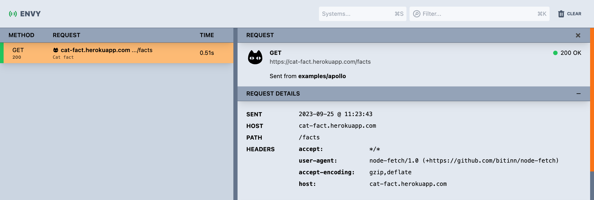

# Customizing Envy

## Creating your own systems

A system is a `class` which defines the following:

- What identifies the trace as belonging to the system, e.g., the hostname, path, etc.
- What icon to display for the system
- What data to show in the list view for the trace
- What data to show in the detail for the trace

**Let's start by example:**

In the application you are sending traces from, you can create a new `class` like the following:

```tsx
// ./src/systems/CatFactsSystem.tsx

import { System, Trace } from '@envyjs/webui';

export default class CatFactsSystem implements System<null> {
  name = 'Cat Facts API';

  isMatch(trace: Trace) {
    // this system applies to all traces which are requests to the `cat-fact.herokuapp.com` host
    return trace.http?.host === 'cat-fact.herokuapp.com';
  }

  getIconBase64() {
    // to ensure that there are no external dependencies, icons should be defined as `data:image/...` base64 data
    return '<base64_image_data>';
  }

  getTraceRowData() {
    // this is the text which will be displayed below the host and path in the list view
    return {
      data: 'This is a cat fact',
    };
  }
}
```

Once you have that system, we need to register it with the Envy viewer. The only way to do this currently is to host the envy viewer yourself as a react component, and pass the systems to register in the props.

For example:

```tsx
// ./src/MyEnvyViewer.tsx

import EnvyViewer from '@envyjs/webui';
import { createRoot } from 'react-dom/client';

import CatFactsSystem from './systems/CatFactsSystem';

function MyEnvyViewer() {
  return <EnvyViewer systems={[new CatFactsSystem()]} />;
}
```

Then, you would serve this component up either on a new route in your application, or as a separate application. For example, using parcel you might have the following:

```tsx
// src/myEnvyViewer.html
<!doctype html>
<html lang="en">
  <head>
    <meta charset="utf-8" />
    <title>My custome Envy viewer</title>
  </head>
  <body>
    <main id="root"></main>
    <script type="module" src="myEnvyViewer.js"></script>
  </body>
</html>


// src/myEnvyViewer.js
import EnvyViewer from '@envyjs/webui';
import { createRoot } from 'react-dom/client';

import MyEnvyViewer from './MyEnvyViewer';

const container = document.getElementById('root');
const root = createRoot(container);

root.render(<MyEnvyViewer />);
```

Finally, in your `package.json`, you would have to start the `@envyjs/webui` collector, opting out of launching the default viewer UI, and load your UI instead:

```
// package.json

{
  "scripts": {
    "start:envy": "concurrently \"yarn start:collector\" \"yarn start:viewer\"",
    "start:collector": "npx @envyjs/webui --noUi",
    "start:viewer": "parcel ./src/myEnvyViewer.html --port 4002 --no-cache"
  }
}
```

Then, running `yarn start:envy` in your application would start the collector process and launch your customized viewer:

<div align="center">
  
</div>
