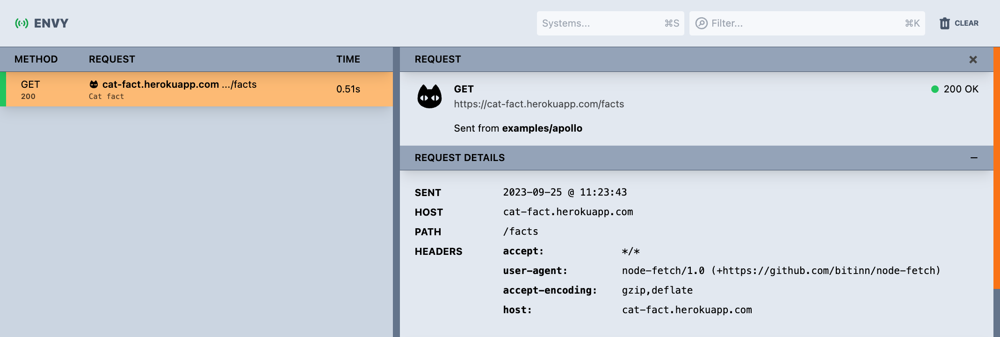
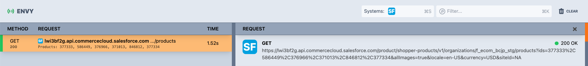
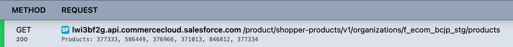
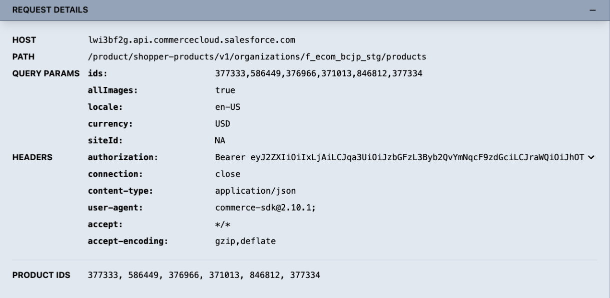
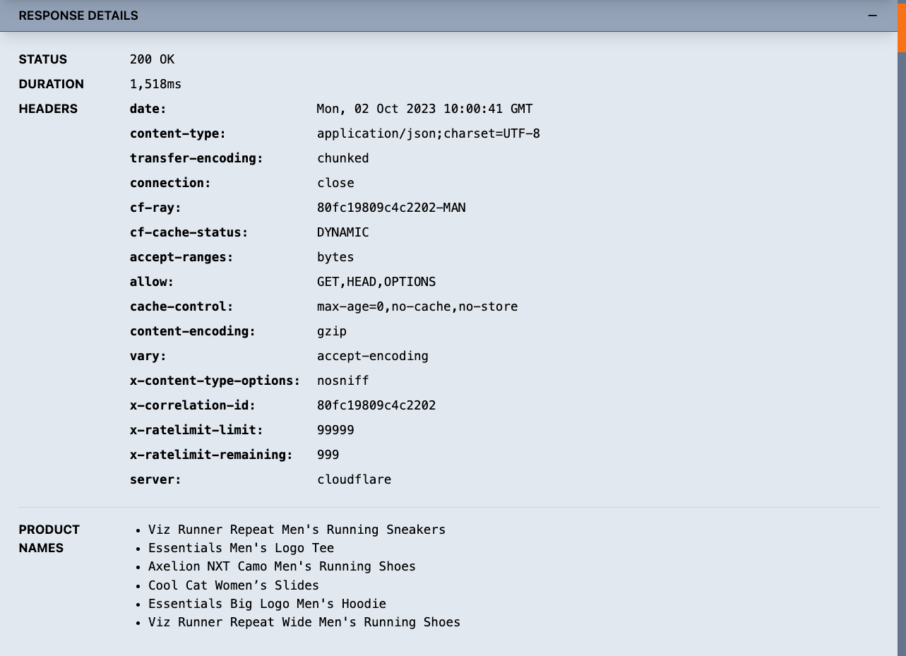

# Customizing Envy


## Contents

- [Introduction](#introduction)
- [Self hosting](#self-hosting)
- [Creating your own systems](#creating-your-own-systems)
- [Basic example walkthrough](#basic-example-walkthrough)
- [System implementation](#system-implementation)


## Introduction

Whilst you can run envy as a standalone viewer using the command `npx @envyjs/webui`, it is also possible to self-host the Envy viewer in order to unlock a number of customization capabilities.

This guide will walk you through how to self-host and customize your Envy viewer.

## Self hosting

The `@envyjs/webui` package has a default export which is the Envy viewer root component; therefore, to self-host Envy, all you need to do is to mount this `EnvyViewer` component somewhere.  It could be in a new route in your application or as a separate standalone application.

For example, we might choose to create a new entry point for a standalone application which can be run alongside your current appliation:

```tsx
// ./src/MyEnvyViewer.tsx

import EnvyViewer from '@envyjs/webui';
import { createRoot } from 'react-dom/client';

const container = document.getElementById('root');
const root = createRoot(container);

root.render(<EnvyViewer />);
```

### Running the Envy collector with a self-hosted viewer

Any self-hosted Envy viewer will need to connect to the Envy collector which is automatically started by the standalone Envy viewer.  In order to start the collector without starting the standalone viewer, you can use the following command:

`npx @envyjs/webui --noUi`

You can then start your custom viewer and it will connect to this collector via web sockets on port `9999`.

The standalone Envy viewer is fully functional, and so the question should be asked "why would I self-host?".  To answer that question, we should look at the ways in which Envy can be customized:

- You can create new systems to filter traces and control presentation

## Creating your own systems

A system is a `class` which defines the following:

- What identifies the trace as belonging to the system, e.g., the hostname, path, etc.
- What icon to display for the system
- What data to show in the list view for the trace
- What data to show in the detail for the trace

## Basic example walkthrough

In the application where you are self-hosting Envy, you can create a new `class` like the following:

```tsx
// ./src/systems/CatFactsSystem.tsx

import { System, Trace } from '@envyjs/webui';

export default class CatFactsSystem implements System<null> {
  name = 'Cat Facts API';

  isMatch(trace: Trace) {
    // this system applies to all traces which are requests to the `cat-fact.herokuapp.com` host
    return trace.http?.host === 'cat-fact.herokuapp.com';
  }

  getIconUri() {
    // to avoid the need for external resources, icons can be defined as base64 data
    return '<base64_image_data>';
  }

  getTraceRowData() {
    // this is the text which will be displayed below the host and path in the list view
    return {
      data: 'This is a cat fact',
    };
  }
}
```

Once you have that system, we need to register it with your self-hosted Envy viewer.  To do this, you can pass your custom systems in as a prop to the `EnvyViewer` component:

```tsx
// ./src/MyEnvyViewer.tsx

import EnvyViewer from '@envyjs/webui';
import { createRoot } from 'react-dom/client';

import CatFactsSystem from './systems/CatFactsSystem';

const container = document.getElementById('root');
const root = createRoot(container);

root.render(
  <EnvyViewer systems={[
    new CatFactsSystem()
    ]}
  />
);
```

Once you have done this, you can start up your self-hosted Envy viewer and you will see that this system has been registered and will control how traces belonging to that system are displayed:

<div align="center">
  
</div>

## System implementation

The following is the interface which all system classes must adhere to:

```ts
interface System<T = null> {
  name: string;
  isMatch(trace: Trace): boolean;
  getData?(trace: Trace): T;
  getIconUri?(): string | null;
  getTraceRowData?(context: TraceContext<T>): TraceRowData | null;
  getRequestDetailComponent?(context: TraceContext<T>): React.ReactNode;
  getRequestBody?(context: TraceContext<T>): any;
  getResponseDetailComponent?(context: TraceContext<T>): React.ReactNode;
  getResponseBody?(context: TraceContext<T>): any;
}
```

---

### `name` - required
The name of the system as it would appear in the system dropdown in the header bar.

**Returns:** `string`

**Example:**
```tsx
name: 'Salesforce'
```

---

### `isMatch` - required
Used to determine whether the supplied trace belongs to this system.  Typically this would be determined based on host or path based details, but any details in the trace can be used to determine whether it is a match.

**Returns:** `boolean`

**Example:**
```tsx
isMatch(trace: Trace) {
  return (trace.http?.host ?? '').endsWith('.commercecloud.salesforce.com');
}
```

---

### `getData` - optional
Used to extract pertinent data from the trace into an object for use in other functions of the system.  This must conform to the type variable used for the system class (i.e., the `T` of `System<T>`).  This data will be included in the `TraceContext` data supplied to other functions of the system implementation.

**Returns:** `T`

**Example:**
```tsx
getData(trace: Trace) {
  const [path, qs] = (trace.http?.path ?? '').split('?');
  const query = new URLSearchParams(qs);
  const productIds = path.endsWith('/product') ? query.get('ids') : [];

  return {
    productIds
  }
}
```

---

### `getIconUri` - optional
Used to define the URI for the icon to be used for the system, as displayed in the trace list, trace detail and system dropdown.  This will be used as the `src` of an HTML `` element, so you can use any valid value for that.

**Returns:** `string`

**Example:**
```tsx
getIconUri() {
  return '<base_64_data>'; // real base64 image data too long to use as an example
}
```

<div align="center">
  
</div>

---

### `getTraceRowData` - optional
Used to specify details to appear for the trace in the trace list.  Currently this defines the "data" to appear below the host and path part of the trace.  This has access to both the `trace` itself and the `data` from the `getData` function.

**Returns:** `{ data: string }`

**Example:**
```tsx
getTraceRowData({ data }: TraceContext<{ productIds: string[] }>) {
  return {
    data: `Products: ${data.productIds.join(', ')}`
  };
}
```

<div align="center">
  
</div>

---

### getRequestDetailComponent - optional
Used to render a custom component after the main request details. This has access to both the `trace` itself and the `data` from the `getData` function.

**Returns:** `React.ReactNode`

**Example:**
```tsx
getRequestDetailComponent({ data }: TraceContext<{ productIds: string[] }>) {
  // note: `@envyjs/webui` exports some useful components for you to retain visual
  // consistency with the UI... more on these later
  return (
    <Fields>
      <Field label="Product IDs">{data.productIds.join(', ')}</Field>
    </Fields>
  );
}
```

<div align="center">
  
</div>

---


### `getRequestBody` - optional
Used to determine what the body of the request is.  This will automatically be the contents of `trace.http.requestBody` and so typically you would not need to override this function, but if you wanted to have some control over what data is presented in the request body part of the trace details, then you can do that here.

**Returns:** `string | undefined`

**Example:**
```tsx
getRequestBody({ trace }: TraceContext<{ productIds: string[] }>) {
  const body = JSON.parse(trace.http?.requestBody ?? '{}');
  delete body.doNotIncludeThisProperty;
  return JSON.stringify(body);
}
```

---

### getResponseDetailComponent - optional
Used to render a custom component after the main response details. This has access to both the `trace` itself and the `data` from the `getData` function.

**Returns:** `React.ReactNode`

**Example:**
```tsx
getResponseDetailComponent({ trace }: TraceContext<{ productIds: string[] }>) {
  // parse the response and get all of the product names to display
  const data = JSON.parse(trace.http?.responseBody ?? '{}');
  const productNames = data.results?.map(x => x.name) ?? [];
  return (
    <Fields>
      <Field label="Product Names">
        <ul>
          {productNames.map(x => (<li key={x}>{x}</li>))}
        </ul>
      </Field>
    </Fields>
  );
}
```

<div align="center">
  
</div>

---

### `getResponseBody` - optional
Used to determine what the body of the response is.  This will automatically be the contents of `trace.http.responseBody` and so typically you would not need to override this function, but if you wanted to have some control over what data is presented in the response body part of the trace details, then you can do that here.

**Returns:** `string | undefined`

**Example:**
```tsx
getResponseBody({ trace }: TraceContext<{ productIds: string[] }>) {
  const body = JSON.parse(trace.http?.responseBody ?? '{}');
  delete body.doNotIncludeThisProperty;
  return JSON.stringify(body);
}
```

